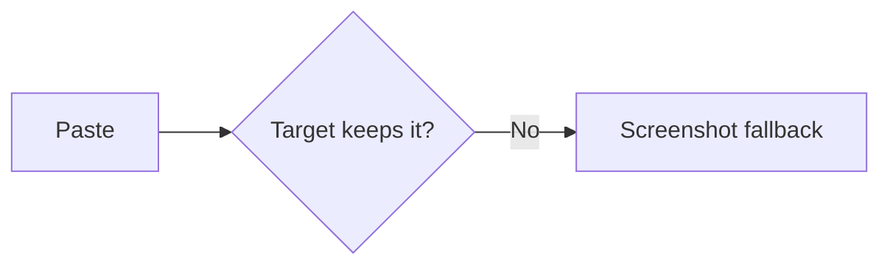

# Copy fixture: rich-text paste fidelity (R3 acceptance)

> Copy the rendered article via the palette action and paste into 微信公众号 /
> 知乎 / Notion (`[manual]`): headings + lists + table must stay intact, code
> keeps its mono block, formulas degrade to `$...$` text, Mermaid becomes a
> placeholder, images carry an re-upload note.

## Headings at every level

### Level three heading

Body text under a deep heading, with a **bold** span and *italic* span.

## Formula targets

Inline math $E = mc^2$ inside a sentence, then display math:

$$
\sum_{i=1}^{n} i = \frac{n(n+1)}{2}
$$

## Mermaid target



## Table target

| heading | list | code |
| ------- | ---- | ---- |
| intact | intact | mono bg |
| Row2A | Row2B | `span` |

## Code target

```ts
export function fidelity(): string {
  return 'mono block with background'
}
```

## Task list target

- [x] Headings survive
- [x] Table survives
- [ ] Images always need re-upload

## Image target


