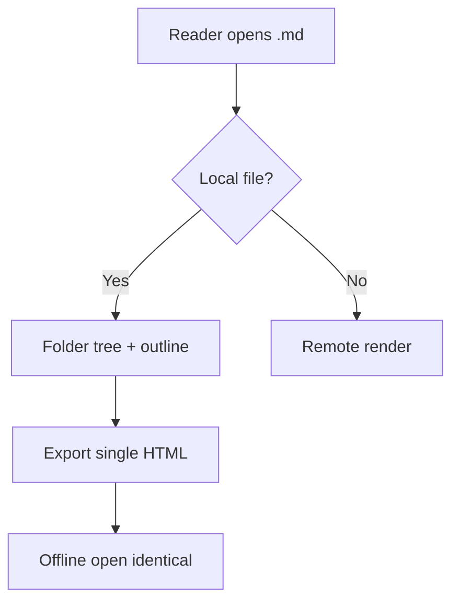
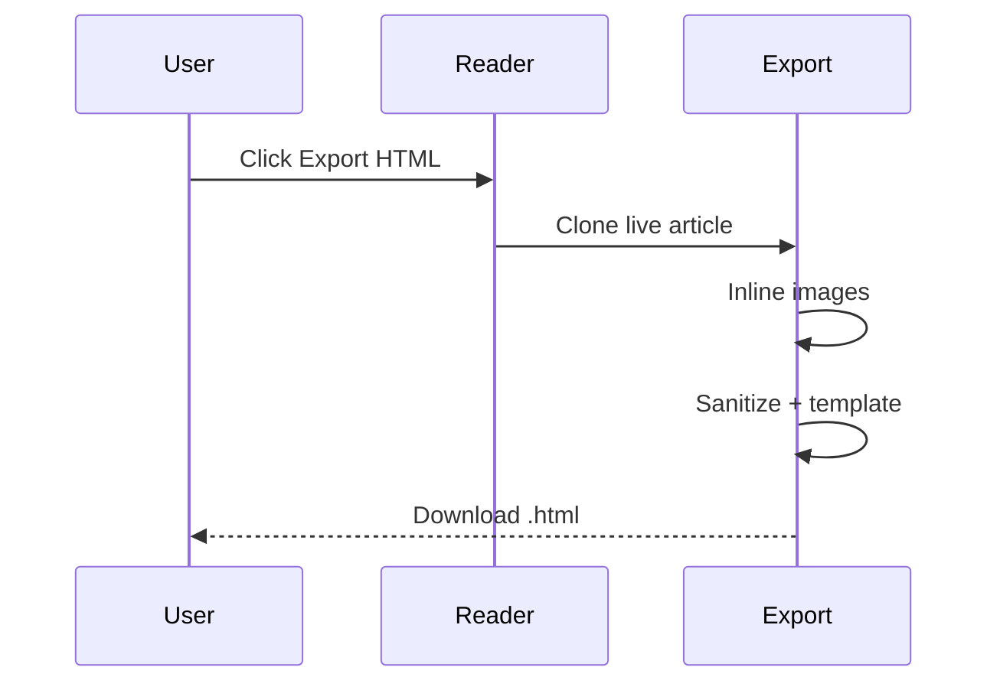

# Export fixture: Mermaid diagrams (R1 acceptance 1)

> Offline export must keep rendered Mermaid SVG inline (serialized from the live DOM).

## Architecture flowchart

## Sequence: export pipeline

## Plain content around diagrams

A paragraph between diagrams ensures layout survival, plus a table for mixed content:

| step | owner | offline |
| ---- | ----- | ------- |
| render | reader | yes |
| inline | export | yes |
| open | browser | yes |
