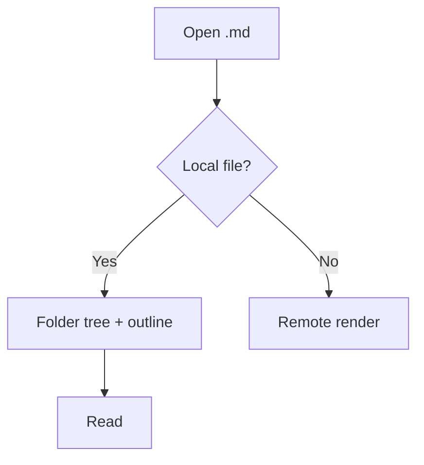

# Viewer test file: safe rendering quartet (R10)

> Modeled on mdview's Safe Test File. Covers task lists + tables + inline
> math + Mermaid in one page. Used by `docs/acceptance-manual.md` visual
> checks (render, export, rich-text copy) and heading-anchor/outline checks.

## Task list

- [x] Rendered checkbox, checked
- [ ] Rendered checkbox, open
- [ ] Nested levels:
  - [x] nested done
  - [ ] nested open

## Table

| Feature    | Expected        | Notes              |
| ---------- | --------------- | ------------------ |
| Alignment  | left/center/rgt | `:-` `:--:` `--:` |
| Code span  | `inline`        | mono background    |
| Math cell  | $a^2+b^2=c^2$   | inline KaTeX       |

| Left | Center | Right |
| :--- | :----: | ----: |
| 1    |   2    |     3 |

## Inline formulas

Pythagoras $a^2+b^2=c^2$, energy $E = mc^2$, and a display block:

$$
\sum_{i=1}^{n} i = \frac{n(n+1)}{2}
$$

## Mermaid diagram



## Code block

```ts
export function quartet(): string {
  return 'tasks + table + math + mermaid'
}
```

## Duplicate headings resolve stably (anchor regression)

### Notes

First notes section.

### Notes

Second notes section (slug must gain a `-1`-style suffix, both anchors distinct).
