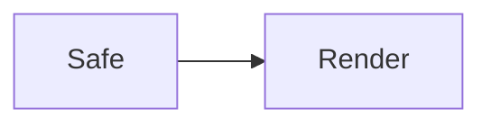

# XSS fixture: render/export sanitize acceptance (R0)

> Open this file in MarkCraft, then run the DOM assertions in
> `docs/acceptance-manual.md` §R0 (needs a real browser DOM: no popup, no
> outbound request in devtools, hostile nodes stripped).
> Each vector below states its EXPECTED outcome against
> `src/content/core/sanitize.ts` (allowlist, zero-dependency, no DOMPurify).
> Safe controls at the bottom must KEEP working (no over-stripping of
> task-list checkboxes, heading ids, Mermaid/KaTeX SVG structure).

## V1. Inline script — EXPECTED: whole element dropped, no alert

## V2. Image with handler — EXPECTED: `onerror` stripped (img may remain, inert)

## V3. javascript: link — EXPECTED: href neutralized, no navigation

[click me](javascript:alert('xss-v3'))

## V4. Case/whitespace evasions — EXPECTED: both neutralized

[upper](JaVaScRiPt:alert('xss-v4a'))

[tab-break](java&#9;script:alert('xss-v4b'))

## V5. data:text/html + vbscript — EXPECTED: both neutralized

[data-html](data:text/html,)

[vbs](vbscript:alert('xss-v5b'))

## V6. Embedded frames/objects — EXPECTED: whole subtrees dropped

<iframe src="https://example.invalid/evil.html"></iframe>

<object data="https://example.invalid/evil.swf"></object>

<embed src="https://example.invalid/evil.swf">

## V7. Head-only tags in body — EXPECTED: dropped

<link rel="stylesheet" href="https://example.invalid/evil.css">

<meta http-equiv="refresh" content="0;url=https://example.invalid/">

## V8. CSS @import exfiltration — EXPECTED: @import stripped, rule inert

## V9. SVG with event handler — EXPECTED: event attrs stripped, svg kept

<svg xmlns="http://www.w3.org/2000/svg" onload="alert('xss-v9')"><circle r="8"/></svg>

## V10. Inline event on common tags — EXPECTED: handlers stripped

clickable div

<a href="#v10" onmouseover="alert('xss-v10b')">hover me</a>

## SAFE CONTROLS — EXPECTED: all preserved

- [ ] Task-list checkbox must keep working (sanitizer never strips `<input>`)
- [x] Checked box stays checked

[Relative link](./viewer-test.md) and [same-page anchor](#v1-inline-script-EXPECTED-whole-element-dropped-no-alert) must keep working.

### Safe heading keeps its id (outline/deep-link regression)

Inline math $E = mc^2$ and a Mermaid block below must render normally
(svg structure preserved, only event attributes stripped):

